# Tiny To-Do — New Relic Observability Lab

A minimal Flask + SQLite to-do app, instrumented step-by-step with New Relic
to demonstrate four observability tools:

1. **APM** — application performance monitoring (transactions, DB calls, errors)
2. **Logs in Context** — application log forwarding correlated with traces
3. **Browser monitoring** — real user metrics from the frontend
4. **Alerts & Dashboards** — NRQL queries, custom dashboards, alert conditions

Each tool is added on its own feature branch so the progression is visible in
`git log` and the branch graph.

This project accompanies the New Relic University courses below:

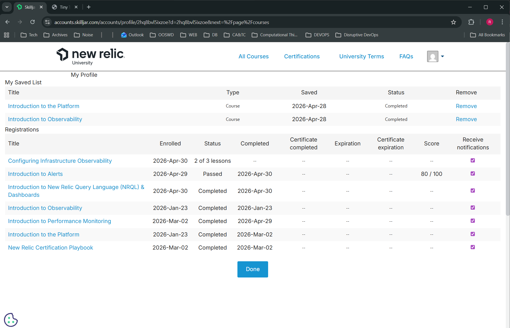

## The app

A single-page Flask + SQLite to-do list — add, toggle done, delete:

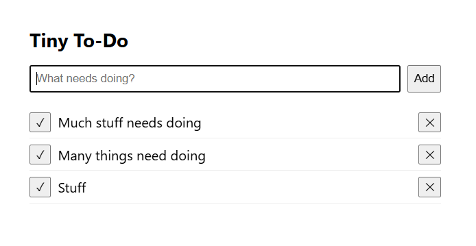

## Prerequisites

- A free New Relic account: https://newrelic.com/signup
- An **INGEST - LICENSE** key (created via *user menu → API keys → Create a key*)
- Either:
  - **VS Code + Docker Desktop** (to use the included dev container — recommended), or
  - Python 3.12+ locally

## Setup

### 1. Clone and open

```bash
git clone git@github.com:RODea-L00203120/NewRelic_Swagger_Demo.git
cd NewRelic_Swagger_Demo
```

If using VS Code: Command Palette → **Dev Containers: Reopen in Container**.
Otherwise create a venv:

```bash
python3 -m venv .venv
source .venv/bin/activate
```

### 2. Install dependencies

```bash
pip install -r requirements-dev.txt
```

`requirements-dev.txt` includes the runtime deps plus `black` and `flake8` for
linting/formatting.

### 3. Configure your New Relic credentials

```bash
cp .env.example .env
```

Edit `.env` and fill in:

```
NEW_RELIC_LICENSE_KEY=<paste-unmasked-INGEST-LICENSE-key-here>
NEW_RELIC_REGION=eu                       # or "us" depending on your account
NEW_RELIC_APP_NAME="Tiny To-Do (Flask)"
```

> The license key MUST be the unmasked value shown in the modal when the key
> is created — not the masked preview from the API keys table, and not the
> key ID.

`.env` is gitignored. `newrelic.ini` is committed but contains no secrets;
the agent reads `NEW_RELIC_LICENSE_KEY` from the environment.

### 4. Run with the agent wrapper

```bash
set -a; source .env; set +a
NEW_RELIC_CONFIG_FILE=newrelic.ini newrelic-admin run-program python app.py
```

Open the forwarded port from the VS Code **Ports** panel (the row labelled
"Flask app (5000)"), or http://localhost:5000 if running locally.

### 5. Verify data is reaching New Relic

```bash
newrelic-admin validate-config newrelic.ini
```

Should print `Registration successful`.

Then in https://one.newrelic.com → **APM & Services**, the entity
**Tiny To-Do (Flask)** should appear within ~60 seconds of the first request.

## What to look at in the New Relic UI

### Tool 1 — APM

The Python agent auto-instruments Flask request handling and the `sqlite3`
driver. Each route is recorded as a separate transaction; queries within a
transaction are captured as nested database segments.

- **Summary** — response time, throughput, error rate, Apdex
- **Transactions** — per-route metrics (`/`, `/add`, `/toggle/<int>`, `/delete/<int>`)
- **Databases** — auto-instrumented SQLite query timings
- **Distributed tracing** — request waterfall with nested spans
- **Errors inbox** — exceptions with stack traces and transaction context

The Transactions view groups requests by route. Each transaction's share of
total time consumed and average response time are visible without any manual
instrumentation:

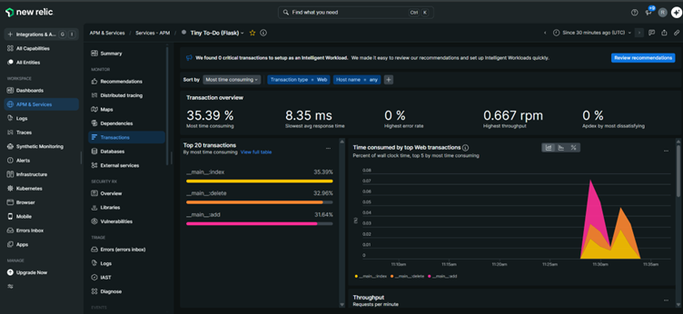

### Tool 2 — Logs in Context

Configured via `application_logging.forwarding.enabled = true` in
`newrelic.ini`. The agent attaches a handler to Python's root logger that
ships records (level, timestamp, message, plus the active `trace.id` and
`span.id`) to New Relic over the same channel as APM data. Because the
identifiers come from the active transaction, the UI can filter logs to a
specific request.

Exercising the app to generate log lines (`app.logger.info("added todo …")`,
`app.logger.warning("rejected empty todo title")`, etc.):

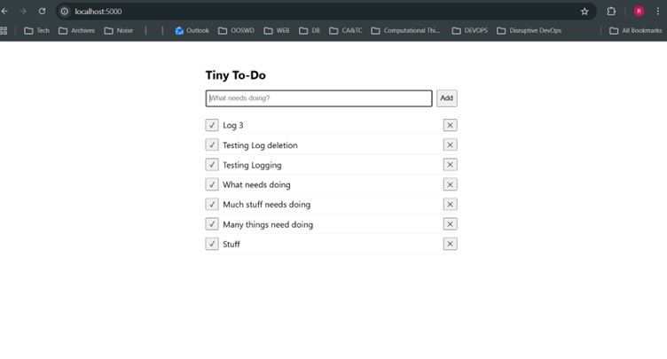

Opening a transaction trace and switching to the **Logs** sub-tab shows only
the log records emitted while that transaction was active — the correlation
is by `trace.id`, not by string matching:

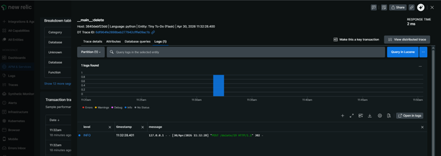

The same data is queryable directly via NRQL. Example: every `added todo`
record in the last hour, with the message and correlation IDs:

```sql
SELECT * FROM Log WHERE message LIKE '%added todo%' SINCE 1 hour ago
```

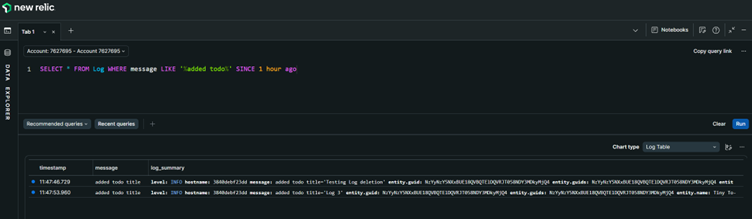

### Tool 3 — Browser monitoring (RUM)

Configured via `browser_monitoring.auto_instrument = true` in `newrelic.ini`.
The agent wraps the WSGI application; on every response with
`Content-Type: text/html` it inserts a small `<script>NREUM…</script>` block
into the `<head>` element of the rendered HTML. The snippet contains the
account/app identifiers and a configuration object — no separate browser
license key is referenced from the page (the snippet itself carries an
ingest token derived server-side at injection time).

Once a browser executes the snippet, it reports:

- Page load timings broken down by phase (network → DOM → onload)
- AJAX call counts and durations (XHR + fetch)
- Uncaught JS errors with stack traces
- Session traces showing user interactions

The data populates a separate **Browser** entity (`Tiny To-Do (Flask)`),
which is automatically linked to the APM entity of the same name. The link
lets the UI render distributed traces that span Browser → Flask → SQLite.

**Verifying the snippet was injected:**

Load the app in your browser, then **View page source** (`Ctrl+U`). The
first script tag inside `<head>` should begin with `;window.NREUM||(NREUM={})`.
If absent, confirm the agent is running and the response Content-Type
contains `text/html`.

**Where to look in NR:**

- Top sidebar → **Browser** → `Tiny To-Do (Flask)` (auto-linked to APM)
- **Page views** — load timings per route
- **JS errors** — uncaught exceptions in the frontend
- **AJAX** — XHR/fetch metrics (sparse here since the app uses form posts)
- **Session traces** — timeline of a real user's interactions

Verifying the injection at the page-source level — the first script in
`<head>` initialises `window.NREUM` and configures the beacon endpoint:

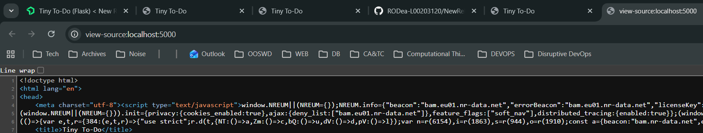

DevTools confirms the snippet is firing — repeated POSTs to
`bam.eu01.nr-data.net` carry the page load and interaction events:

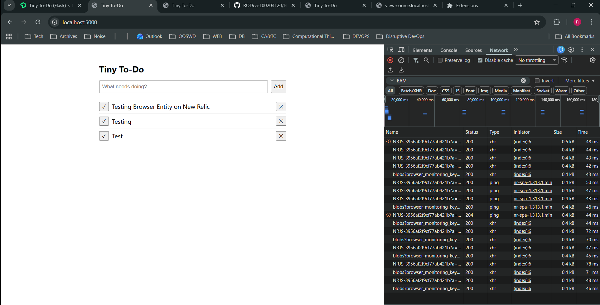

Within ~2 minutes a Browser application entity is auto-created and linked
to the APM service of the same name, so the All Entities view lists both:

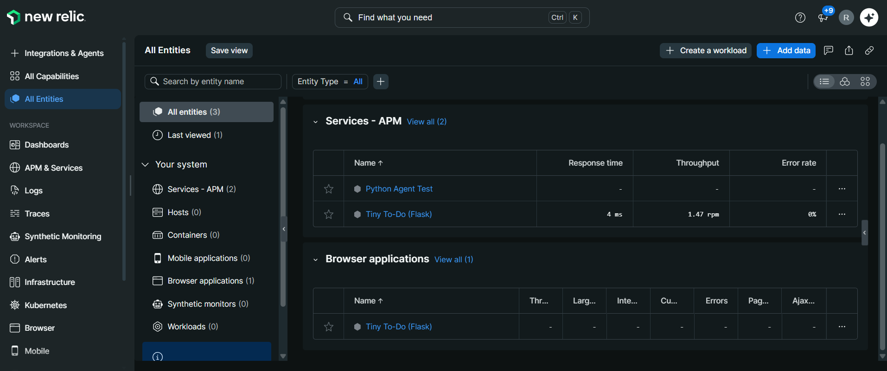

The Browser entity's Summary surfaces Core Web Vitals (LCP, INP, CLS) and
the loading-performance distribution across page loads:

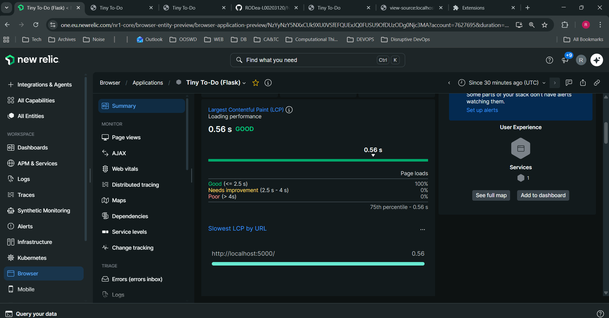

The Page views section breaks median response time down by browser
interaction (initial page load vs. route change):

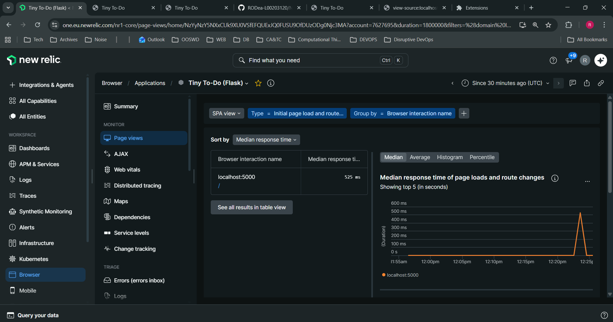

> **Note for production:** ad blockers and tracker-blocking extensions
> include `js-agent.newrelic.com` and `bam.*.nr-data.net` on default block
> lists, suppressing RUM data for affected users. This is an inherent
> limitation of any client-side observability tool — server-side metrics
> (APM) remain unaffected.

## Code style

```bash
black .
flake8
```

Configured in `pyproject.toml` and `.flake8` respectively. Black handles
formatting; flake8 catches issues Black doesn't (unused imports, undefined
names, etc).

## Troubleshooting

- **`externally-managed-environment` on `pip install`** — you're outside the
  dev container on a host with PEP 668. Use the dev container or create a
  venv.
- **`Forbidden` when opening the forwarded port** — Flask is bound to
  `127.0.0.1`. The app is configured for `0.0.0.0`; if you've changed it,
  revert.
- **`incorrect license key` errors in agent log** — check `NEW_RELIC_REGION`
  matches your account, and ensure `newrelic.ini` does not have any
  `license_key = ...` line (the file overrides env vars, so even an empty
  line wins over `NEW_RELIC_LICENSE_KEY`).
- **No data in NR after 2 minutes** — restart the server after editing
  `.env`; env vars are read at process start, not re-read mid-run.
